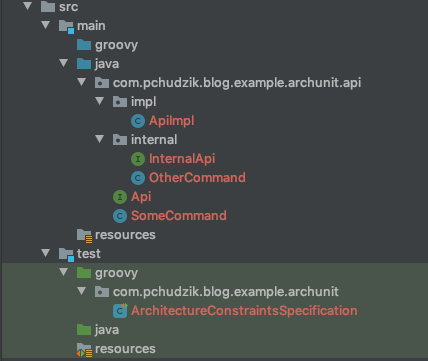

In the past, I’ve https://blog.pchudzik.com/201903/test-names-conventions/[implemented couple of
tests] that aimed to verify naming conventions or some other practices team agreed upon. And
presented a way https://blog.pchudzik.com/201906/code-style/[how to ensure they are followed]. When
I’ve been writing those I was not aware that there is a library that aims to test architecture
conventions - https://www.archunit.org[ArchUnit] in this post I’ll write a simple test case to check
what’s possible out of the box.

<!--more-->

[.lead]
TL;DR

Using ArchUnit you can pretty easy verify if code you are writing matches conventions you want to
have in your codebase. See https://www.archunit.org/userguide/html/000_Index.html[documentation] of
ArchUnit library.

[.lead]
Intro

From the home page of https://www.archunit.org[ArchUnit]:

[quote, https://www.archunit.org]
____

ArchUnit is a free, simple and extensible library for checking the architecture of your Java code
using any plain Java unit test framework. That is, ArchUnit can check dependencies between packages
and classes, layers and slices, check for cyclic dependencies and more. It does so by analyzing
given Java bytecode, importing all classes into a Java code structure.

____

It sounds pretty nice as those are the things that are usually aligned on some meeting and hopefully
stored somewhere on the confluence and best checks that can be done are on code review and maybe in
sonar once in a while. With ArchUnit we can guarantee that build will not pass when aligned on rules
are not met. What’s more in ArchUnit itself there are plenty of ready to use rules and adding new is
straightforward and should not be complicated.

[.lead]
Samples

Let’s see how we can enforce test naming conventions (which I’ve implemented in plain java in
https://blog.pchudzik.com/201903/test-names-conventions/[one of my previous posts]):


def "all test classes follow naming convention"() {
    given:
    final allClasses = new ClassFileImporter().importPackages("com.pchudzik.blog.example.archunit")
    final rule = ArchRuleDefinition.classes().that()
            .areAssignableTo(Specification.class)
            .should().haveNameMatching(".*ArchSpecification\$")
            .orShould().haveNameMatching(".*IntegrationSpecification\$")
            .orShould().haveNameMatching(".*UnitSpecification\$")

    expect:
    rule.check(allClasses)
}


As you can see tests are readable and exceptions reported by the library are easy to understand:


rule.check(allClasses)
|    |     |
|    |     [JavaClass{name='com.pchudzik.blog.example.archunit.api.impl.ApiImpl'}, JavaClass{name='com.pchudzik.blog.example.archunit.api.internal.InternalApi'}, JavaClass{name='com.pchudzik.blog.example.archunit.api.internal.OtherCommand'}, JavaClass{name='com.pchudzik.blog.example.archunit.api.SomeCommand'}, JavaClass{name='com.pchudzik.blog.example.archunit.ArchitectureConstraintsSpecification'}, JavaClass{name='com.pchudzik.blog.example.archunit.api.Api'}]
|    java.lang.AssertionError: Architecture Violation [Priority: MEDIUM] - Rule 'classes that are assignable to spock.lang.Specification should have name matching '.*ArchSpecification$' or should have name matching '.*IntegrationSpecification$' or should have name matching '.*UnitSpecification$'' was violated (1 times):
|    Class <com.pchudzik.blog.example.archunit.ArchitectureConstraintsSpecification> does not match '.*ArchSpecification$' in (ArchitectureConstraintsSpecification.groovy:0) and Class <com.pchudzik.blog.example.archunit.ArchitectureConstraintsSpecification> does not match '.*IntegrationSpecification$' in (ArchitectureConstraintsSpecification.groovy:0) and Class <com.pchudzik.blog.example.archunit.ArchitectureConstraintsSpecification> does not match '.*UnitSpecification$' in (ArchitectureConstraintsSpecification.groovy:0)
|    	at com.tngtech.archunit.lang.ArchRule$Assertions.assertNoViolation(ArchRule.java:92)
|    	at com.tngtech.archunit.lang.ArchRule$Assertions.check(ArchRule.java:82)
|    	at com.tngtech.archunit.lang.ArchRule$Factory$SimpleArchRule.check(ArchRule.java:196)
|    	at com.tngtech.archunit.lang.syntax.ObjectsShouldInternal.check(ObjectsShouldInternal.java:81)
|    	at com.pchudzik.blog.example.archunit.ArchitectureConstraintsSpecification.all test classes follow naming convention(ArchitectureConstraintsSpecification.groovy:18)
classes that are assignable to spock.lang.Specification should have name matching '.*ArchSpecification$' or should have name matching '.*IntegrationSpecification$' or should have name matching '.*UnitSpecification$'


Comparing to my by handwritten implementation you can see clearly that the same check is done in a
fraction of the code that is required to do it by yourself. And it works the same what’s more it
offers verbose API that is easy to understand and navigate using code completion for the IDE.

To do one more example we can simply add a rule that ensures that public API is public and nothing
from internal system functionalities is not leaking to the outside users. Let’s assume you have
following classes and don’t want anything from internal package to be used in API package as those
are internals of the system and you don’t guarantee their stability and compatibility between
application versions.

[.center-image]

With ArchUnit we can easily write a test that makes sure that assumption is followed in the code:


def "internal api can not leak to public api"() {
    given:
    final allClasses = new ClassFileImporter().importPackages("com.pchudzik.blog.example.archunit")
    final rule = ArchRuleDefinition.noClasses().that()
            .resideInAPackage("..api..")
            .should()
            .dependOnClassesThat().resideInAPackage("..internal..")

    expect:
    rule.check(allClasses)
}


And as I’ve intentionally used InternalCommand in public API test fails with following error message:


rule.check(allClasses)
|    |     |
|    |     [JavaClass{name='com.pchudzik.blog.example.archunit.api.impl.ApiImpl'}, JavaClass{name='com.pchudzik.blog.example.archunit.api.internal.InternalApi'}, JavaClass{name='com.pchudzik.blog.example.archunit.api.internal.OtherCommand'}, JavaClass{name='com.pchudzik.blog.example.archunit.api.SomeCommand'}, JavaClass{name='com.pchudzik.blog.example.archunit.ArchitectureConstraintsSpecification'}, JavaClass{name='com.pchudzik.blog.example.archunit.api.Api'}]
|    java.lang.AssertionError: Architecture Violation [Priority: MEDIUM] - Rule 'no classes that reside in a package '..api..' should depend on classes that reside in a package '..internal..'' was violated (5 times):
|    Class <com.pchudzik.blog.example.archunit.api.impl.ApiImpl> implements interface <com.pchudzik.blog.example.archunit.api.internal.InternalApi> in (ApiImpl.java:0)
|    Method <com.pchudzik.blog.example.archunit.api.Api.doMoreWork(com.pchudzik.blog.example.archunit.api.internal.OtherCommand)> has parameter of type <com.pchudzik.blog.example.archunit.api.internal.OtherCommand> in (Api.java:0)
|    Method <com.pchudzik.blog.example.archunit.api.impl.ApiImpl.doInternalWork(com.pchudzik.blog.example.archunit.api.internal.OtherCommand)> has parameter of type <com.pchudzik.blog.example.archunit.api.internal.OtherCommand> in (ApiImpl.java:0)
|    Method <com.pchudzik.blog.example.archunit.api.impl.ApiImpl.doMoreWork(com.pchudzik.blog.example.archunit.api.internal.OtherCommand)> has parameter of type <com.pchudzik.blog.example.archunit.api.internal.OtherCommand> in (ApiImpl.java:0)
|    Method <com.pchudzik.blog.example.archunit.api.internal.InternalApi.doInternalWork(com.pchudzik.blog.example.archunit.api.internal.OtherCommand)> has parameter of type <com.pchudzik.blog.example.archunit.api.internal.OtherCommand> in (InternalApi.java:0)
|    	at com.tngtech.archunit.lang.ArchRule$Assertions.assertNoViolation(ArchRule.java:92)
|    	at com.tngtech.archunit.lang.ArchRule$Assertions.check(ArchRule.java:82)
|    	at com.tngtech.archunit.lang.ArchRule$Factory$SimpleArchRule.check(ArchRule.java:196)
|    	at com.tngtech.archunit.lang.syntax.ObjectsShouldInternal.check(ObjectsShouldInternal.java:81)
|    	at com.pchudzik.blog.example.archunit.ArchitectureConstraintsSpecification.internal api can not leak to public api(ArchitectureConstraintsSpecification.groovy:30)
no classes that reside in a package '..api..' should depend on classes that reside in a package '..internal..'


[.lead]
Summary

The biggest advantage that ArchUnit offers is verbose API and a lot of ready to use rules that can be just dropped into the project and be used. What’s more, you can easily extend it to introduce new rules and checks that are specific to your system. You should give it a try and see for yourself how easy and future proof are tests that verify not only business logic but also architectural assumptions about the system.

* https://github.com/blog-pchudzik-examples/archunit[Source code of the samples]
* https://www.archunit.org[ArchUnit home page]
* https://www.archunit.org/getting-started[ArchUnit getting started]
* https://www.archunit.org/userguide/html/000_Index.html[ArchUnit user guide]
* https://github.com/TNG/ArchUnit-Examples[More samples]
