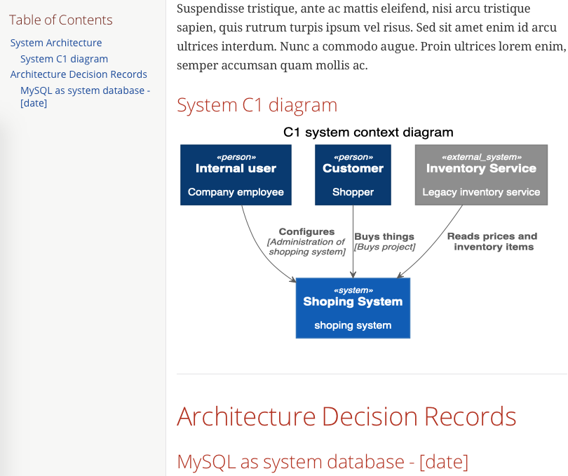

One thing that a lot of people hate to do is writing documentation.
Usually, it’s postponed until development is finished and once it's done there is rarely time to do it properly.
If you get past the struggle of writing it down there is always a problem of keeping it up to date.
To avoid those pain points I’m going to explore what we can do with Asciidoctor to simplify this problem.

<!--more-->

The default way of storing documentation is some kind of wiki software running somewhere on the server or in the cloud.
It has many advantages as easy access and simple updates.
In most cases it is a perfect solution for documenting the business side of the project because not technical people can easily contribute to it.
The problem is that it might not be the best place to keep technical documentation in.
It requires some effort to keep it up to date because it changes at a different rate than the source code.

[.center-image]

Technical documentation is strongly coupled with the system it describes that's why it makes perfect sense for it to be stored next to the source code.

* When it's close to the code it is easier to keep it up to date.
* Developers can easily update it as they go, documentation change can be (code) reviewed like any other source code modification.
* Because docs live in the same repository as the source code any change we do to the application's source files can be reflected in the project documentation as we implement those changes.
* It's much easier to remember about updating documentation because it is located very close to source files.

Simplest practice might be to just drop markdown files inside one folder in the repository and simply align on this convention with the team.
If you are using GitHub, Bitbucket or GitLab you can try to use wiki which is also linked with the repository
(I don't use this approach because there is only one version of the documentation that doesn't live with source code and it requires extra effort to update).

If you decide to go all the way with the technical documentation inside a repo then a simple markdown format might not be enough when it's getting bigger and more complex.
Jumping between files finding how they are linked together can be problematic at a certain scale.
At some point you'll need more possibilities like adding diagrams, including source code, exporting it to be available as HTML or PDF documents.
Once you'll get there you can explore other tools available on the market and one of them is asciidoc format.

With https://asciidoctor.org[Asciidoctor] - asciidoc implementation (https://asciidoctor.org/docs/asciidoc-asciidoctor-diffs/[on asciidoc and asciidoctor]) it’s quite easy to generate project documentation.
You can use https://asciidoctor.org/docs/asciidoctor-gradle-plugin/[Gradle] or https://asciidoctor.org/docs/asciidoctor-maven-plugin/[Maven] plugin or even spin up https://hub.docker.com/r/asciidoctor/docker-asciidoctor[Docker] to generate it on demand or during project build process.

Before we start we should get familiar with the syntax of the format:

* https://asciidoctor.org/docs/asciidoc-syntax-quick-reference/[Quick reference] summarizes what can be done
* https://asciidoctor.org/docs/user-manual/[User manual] provides all the details you might need

Once basic are covered we can write a couple of pages to get better filling of it.


:page-layout: docs      // attributes
:doctitle: my system
:toc: left
:source-highlighter: coderay
:data-uri:
:doctype: book
:icons: font
:imagesdir: .

Lorem ipsum dolor sit amet...

include::architecture_diagram.adoc[]  // includes

include::adr/index.adoc[]



Form this short sample you can already notice some https://asciidoctor.org/docs/user-manual/#attribute-catalog[attributes] which can be also passed from the https://asciidoctor.org/man/asciidoctor/#document-settings[command line].
Documents can be https://asciidoctor.org/docs/user-manual/#include-directive[split into many files] that can be linked together and all you have to do is let asciidoctor know that you wan to include them in the output document.

Very convenient feature that asciidoctor offers is https://asciidoctor.org/docs/asciidoctor-diagram/[generating diagrams directly from the documentation].
Below is example of http://plantuml.com[plantuml] diagram.


== System Architecture

=== System Context diagram

[plantuml, architecture_diagram, svg]
....
!includeurl https://raw.githubusercontent.com/RicardoNiepel/C4-PlantUML/release/1-0/C4_Container.puml

title C1 system context diagram

Person(internal, "Internal user", "Company employee")
Person(customer, "Customer", "Shopper")

System(shopping_system, "Shoping System", "shoping system")
System_Ext(inventory_service, "Inventory Service", "Legacy inventory service")

Rel(internal, shopping_system, "Configures", "Administration of shopping system")
Rel(customer, shopping_system, "Buys things", "Buys project")

Rel(inventory_service, shopping_system, "Reads prices and inventory items")
....


Here we've just dropped simple http://plantuml.com[plantuml] diagram which will be converted into SVG image at build time (and thanks to `:data-uri:` attribute embedded into HTML as bas64 image).

Now we’ve got our documentation in some markup language, but reading a diagram might be a bit easier when it's an image, not text describing it.
We need an HTML (for PDF just change backend) file so we can easily share it with all sorts of architects, team members or other teams.

If you are using Gradle all we need to do is add one plugin to the project:


buildscript {
    repositories {
        jcenter()
    }

    dependencies {
        classpath 'org.asciidoctor:asciidoctor-gradle-plugin:1.6.1'
         classpath "com.github.jruby-gradle:jruby-gradle-plugin:1.5.0"
    }
}

plugins {
    id 'java'
}

apply plugin: 'org.asciidoctor.convert'
apply plugin: 'com.github.jruby-gradle.base'

group = 'com.pchudzik.blog.example.documentation'
version = '0.0.1-SNAPSHOT'
sourceCompatibility = '1.8'

repositories {
    mavenCentral()
}

dependencies {
    gems 'rubygems:asciidoctor-diagram:1.5.19'
}

asciidoctor {
    dependsOn jrubyPrepare
    gemPath = jrubyPrepare.outputDir
    sourceDir = file('docs')
    sources {
        include 'index.adoc'
    }
    separateOutputDirs = false
    logDocuments = true
    outputDir = file('build/docs')
    requires = ['asciidoctor-diagram']
}


Other options are https://asciidoctor.org/docs/asciidoctor-gradle-plugin/#options-attributes[documented] on the https://asciidoctor.org/docs/asciidoctor-gradle-plugin/[plugin site].

If you are not using Gradle you can always use https://asciidoctor.org/docs/asciidoctor-maven-plugin/[maven-plugin] (or you can run docker from maven which might be easier than writing tons of XML markup;))
Another way which I think is somewhere in the middle between generating documentation automatically and generating it by hand is by using docker image:


docker run \
    --rm \
    -v $(pwd):/documents/ \
    asciidoctor/docker-asciidoctor \
    asciidoctor \
    -r asciidoctor-diagram \
    -o docs/docker_out.html docs/index.adoc


You can put it as `build_docs.sh` and simply run it from `pom.xml` or `build.gradle` or by hand when necessary.
With this, we can easily generate HTML and/or pdf document ant it will look somehow like this:

[.center-image]

In case you have a big system and need to build documentation which will comprise of all projects documentation you can take a look at tools like https://antora.org[antora] (haven't tried this one yet).

Keeping documentation alive and up to date is beneficial in any size project.
Storing it close to the source code can quite an easy task (it is really hard to find an excuse not to write documentation&nbsp;;).
You should do anything you can that can help out in writing just the right amount of documentation and keeping it alive through project lifespan.
If you don't like asciidoc format you can stick with simple markdown files or explore other documentation formats like http://docutils.sourceforge.net/rst.html[reStructuredText] and http://www.sphinx-doc.org/en/master/[sphinx].
I think Asciidoctor might be a pretty simple way of having easy to update technical project documentation.
As always complete sample can be found https://github.com/blog-pchudzik-examples/documentation[on my GitHub].

[.small]
https://www.pexels.com/photo/batch-books-document-education-357514/[Image credits]
