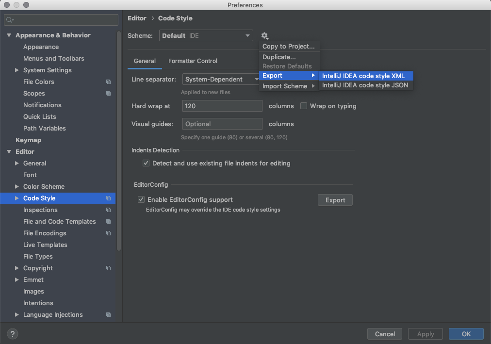

When the whole team agrees on coding standards we tend to be optimistic. We think that from now on
everything will be exactly as we decided. The truth is that usually after a couple of months you’ll
reinstall IDE or system and forget about configuration or new people join and it’s the Wild West all
over again.

<!--more-->

[.lead]
TL;DR

* Export IDE settings to be easy to import and shared between all team members and put it into
  version control so it’s easy to find and import code style.
* If you want to make it truly consistent introduce check style as part of the build process so the
  build will fail when conventions are broken.

It is not the most important topic but when you’ll have to review the change of tabs to spaces and
different import order for the 4th time you might notice that something is wrong. It also makes git
history less useful as you’ll have a lot of commits made in the file just because someone has
autoformatter on. And trust me with a long-lived project you might want to keep files history as
straight and simple as possible…

[.lead]
Shared code style

If the whole team uses the same IDE it’s very easy. All you have to do is to import code style from
IDE and put it in the version control along with project code. Then ensure all team members have
imported those settings and are using them. By exporting configuration you are making sure all team
members are using the exactly the same coding conventions. As for new team members -  with 4 clicks,
they have everything configured and are ready to go.

[.center-image]

So you’ve exported code style from IntelliJ but not everyone is using IntelliJ maybe someone prefers
eclipse or something different. You should export configuration from whatever IDE most of the team
is using to make it easy for most of the team. Then make sure that it’s impossible to break the
rules :)

[.lead]
Enforcing code style

So there is this one guy who prefers to use vim for writing the code. We should guarantee that code
conventions are followed no matter the tool. The easiest way will be to automate the process. We can
easily do that by adding check style to the project.

In maven:


<build>
    <plugins>
        <plugin>
            <groupId>org.apache.maven.plugins</groupId>
            <artifactId>maven-checkstyle-plugin</artifactId>
            <version>3.1.0</version>
            <configuration>
                <configLocation>checkstyle/checkstyle.xml</configLocation>
                <failOnViolation>true</failOnViolation>
                <violationSeverity>warning</violationSeverity>
                <includeTestSourceDirectory>true</includeTestSourceDirectory>
                <maxAllowedViolations>0</maxAllowedViolations>
            </configuration>
            <executions>
                <execution>
                    <id>validate</id>
                    <phase>validate</phase>
                    <goals>
                        <goal>check</goal>
                    </goals>
                </execution>
            </executions>
        </plugin>
    </plugins>
</build>


The trick to fail the build with maven is to set configuration key violationSeverity to true.
Otherwise, everything will be logged as warning and build will pass. If you need different build
process just check the documentation.

Or in gradle:


plugins {
    id 'java'
    id 'checkstyle'
}

group = 'com.pchudzik.blog.examples'
version = '0.0.1-SNAPSHOT'
sourceCompatibility = '1.8'

repositories {
    mavenCentral()
}

dependencies {
}

checkstyle {
    ignoreFailures = false
    maxWarnings = 0
    maxErrors = 0
}


With this, all we have to do is to configure the rules in XML file and we are good to go.

In case you are not doing it in a brand new project, you can either do uber commit with all files
formatted (just pick reasonable time so it will be easy to merge in) or configure a maximum number
of violations allowed in the project and make sure to decrease this number once in a while.

[.lead]
Resources

* https://github.com/blog-pchudzik-examples/code-style/tree/master/gradle[Sample gradle project]
* https://github.com/blog-pchudzik-examples/code-style/tree/master/maven[Sample maven project]
* https://checkstyle.sourceforge.io/index.html[Checkstyle home page and documentation]
* https://maven.apache.org/plugins/maven-checkstyle-plugin/check-mojo.html[Checkstyle maven plugin documentation]
* https://maven.apache.org/plugins/maven-checkstyle-plugin/examples/multi-module-config.html[How to configure Checkstyle in multimode maven project]
* https://docs.gradle.org/current/dsl/org.gradle.api.plugins.quality.Checkstyle.html[Gradle check style plugin documentation]
