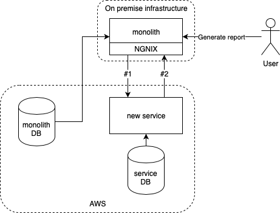

At work, we are slowly breaking down the monolithic application into smaller manageable services.
Some time ago we had a very interesting issue which proved that microservices are hard to implement.
It's especially true if you are not there yet but somewhere in the middle.
When you need to introduce intermediate solutions which will enable you to work further on the migration to service oriented architecture.

<!--more-->

[.center-image]
image::cloud.jpg[cloud]

We have this monolithic application and it has not optimal persistence layer - both in terms of the way data access is implemented and how database schema looks like.
One team is slowly but methodically moving parts of one subdomain from the monolith and migrating them into new service.
We are in the middle of the process and sometimes weird hacks are implemented to separate some layers in the monolith.
We are doing those steps to enable further data migration, make data access more efficient, clearly separate responsibilities of services and have deployable application all at the same time.
One of those hacks we've implemented bite our ass quite hard recently.

We are also in the middle of the other project called https://content.pivotal.io/blog/enterprise-journey-to-the-cloud["monolith journey to the cloud"].
We are almost done with it but not quite there yet.
Our testing servers are already running in AWS cloud but production is still on-premises.

There is also reporting functionality and it's implemented in the monolith (with this architecture at least you know where to look for it ;)).
Some part of the data required for the report has been already migrated from monolith but some of it is still in the monolith's database.
New service is already used in some places.
We decided that it should be responsible for serving all the data from its subdomain.
Clients should not worry about our internal struggle with the migration and current layout of the services.
For a time being we've ended up with something like this:

[.center-image]

When the user wants to generate a report he asks monolith to do so and then the flow is following:

* Monolith pulls some data from its own DB
* Via HTTP, monolith asks new service for the data (#1) which already belongs to the new service
* New service fetches what it already has from its own DB
* New service calls via HTTP back to monolith to fetch the data that's have not been yet migrated and merges these two data sets
* New service sends response back to monolith
* Monolith builds report and sends it back to user (via email or to her browser)

If everything goes right user receives a report within a couple of seconds.

This is not optimal architecture because we have circular dependencies between services and report is generated online instead of being generated asynchronously.
We decided we prefer to introduce circular dependency than pooling the data directly from the monolith DB.
We are also working on business features (mostly) and we did not want to cause some unexpected errors because we forgot to update the service in case of DB schema change.

[.center-image]

When migrating some of the data to the new service we had to ensure that reporting will work and to do so we've implemented step #2 from the diagram.
The SQL query has been written in monolith to fetch the data which should belong to the new service from the DB.
The new service was able to merge what it already owns with everything else received from the monolith into one data set.
Everything worked just fine when we've been testing it.

After deploying it on production we've noticed that everything works much slower than usual.
At some point load on the DB reached 100% and we had to restart the application.
What is worse we had no way to rollback to the previous version as we've removed a quarter of the monolith database as it was migrated to new service.
What a beautiful disaster it was ;)

[.center-image]

We quickly found the functionality that was causing the issues and disabled it - no reporting for some time.
Internal users were not very happy about it (reporting is only for internal users) but the choice was obvious.
Now with the feature disabled we bought ourselves some time to work on the real issue.

First.
The SQL query to load the data for call #2 was implemented in a way that loaded all the data in a single shot.
If you are using a lot of fetch joins for collections in hibernate you must know that under the hood SQL query is creating a Cartesian product.
We've been loading gigabytes of data to feed in the report.

Second.
We are using https://github.com/OpenFeign/feign[feign] to generate rest clients for communications between services.
It's working like a charm providing convenient retrying mechanism.
In front of the monolith application, there is a load balancer with a timeout configured (Nginx).

Our circular dependency along with slow SQL query and feigns retry mechanism caused the DDOS effect on the system.
Here's how it worked:

. Monolith queried for some data from the service - #1
. Service called monolith back - #2
. Query #1 timed out on load balancer
. Feign re-tried to run call #1 again
. In the meantime #2 REST call timed out in monolith
. Feign re-tried calling #2 again

Retry mechanism caused us to load gigabytes of data from DB 25 times.
Users are busy people and they don't have time to wait, this particular report used to be fast.
Each one of them triggered the report a couple of times just to be sure it's working and to make it a bit faster ;)

[.center-image]

With a bit of optimistic engineering, happy path testing and forgetting about https://en.wikipedia.org/wiki/Fallacies_of_distributed_computing[8 fallacies of distributed computing] (https://www.simpleorientedarchitecture.com/8-fallacies-of-distributed-systems/[simpleorientedarchitecture.com]) we were able to DDOS our system.
There is a couple of lessons to learn here.

* *Have at least one environment with the same infrastructure setup as production* (or as similar to production as possible).
  Our testing environment is fully on AWS sending gigabytes of data through the network was https://aws.amazon.com/blogs/aws/the-floodgates-are-open-increased-network-bandwidth-for-ec2-instances/[really fast].
  Sending the same amount of data to on-premise infrastructure was not.
* *Know your tools - feign*.
  Feign retries call 5 times by default.
  With impatient users (or aggressive service) and circular dependencies between services and without https://github.com/OpenFeign/feign/tree/master/hystrix[circuit breaker], we can DDOS our system.
* *Know your tools - hibernate*.
  You can load gigabytes of data from the DB if you don't know how SQL works.
  If you've heard about n+1 queries problem and applied the first solution you've found on the internet to solve it - fetch join you might have some performance issues.
  The number of executed queries should not be the only measurement of how to effectively communicate with DB (https://allaroundjava.com/hibernate-cartesian-product-problem/[always mind the abstraction and what it'll do]).
* *Temporal in temporal solutions is a relative term* - circular dependency thing.
  Temporal might mean days, weeks or months.
  Be sure you are picking the right hack for the time span it'll stay there.
  There is always the risk that temporal solution will become a permanent one so the hack should be chosen wisely.
  All prons and cons should be carefully considered by the whole team and https://www.goodreads.com/quotes/33373-better-to-have-and-not-need-than-to-need-and[contingencies should be prepared].
* *Do not deploy backward-incompatible change with a bunch of other risky changes* without carefully considering what bad might happen.
  The possibility of the rollback would be nice as it's the easiest way to put down the fire caused by the new version.
* *Do not try to fix the problem you don't understand*.
  There were a lot of ideas on how to fix the issue (rush production deployment to AWS NOW because it's already on fire).
  You'll be fighting fire with fire and the new one might be even hotter than the one you already have.
* *Not everything must be realtime or as preferment as it can be*.
  Reporting is one of those things that can be executed in the background in our system.
  Users don't mind waiting for megabytes of excel a couple of minutes as they are usually requesting it to be sent on their email address.

[.center-image]

Luckily everything ended up well and we have learned a couple of things from our mistake.
We've deployed first fixes in hours and it allowed users to work as usual.
In two days we've deployed a proper and fully working version so everything is good.
From the user perspective, it looked like a hiccup of the system but for us, it was big fuckup and we've learned our lesson from it.

[.small]
Image credits:

[.small]
* https://www.pexels.com/photo/blue-sky-and-white-clouds-231009/
* https://www.pexels.com/photo/everything-is-connected-neon-light-signage-1356300/
* https://www.pexels.com/photo/grayscale-photo-of-explosion-on-the-beach-73909/
* https://www.pexels.com/photo/accident-action-adult-blaze-280076/
* https://www.pexels.com/photo/abc-books-chalk-chalkboard-265076/