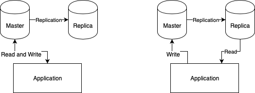

Some time ago we had a problem with performance caused by generating big reports for users.
During one of the firehouse meetings, there was an idea to generate reports from the replica database.
We've solved the issue differently but the idea got me interested.
In this post, I'll configure spring-boot based application to use the replica database for all read-only transactions.

<!--more-->

The problem itself turned out to be relatively easy to fix and resolve.
That's why the idea to route all reads to the slave database has not been implemented (and in this version might've caused us more harm than good).
But I've never done anything like that so I decided to see what can be done and how hard it is when you want to use different database connections for the same persistence unit.

First things first - the architecture.
There is a monolithic application which is not so easy to split and as always there are other business priorities.
We have two instances of the database - one master and slave instance as a backup database ready to be used (everything is running on AWS's RDS) - on the left of the schema.
The idea is to write data to the master database as we are doing it right now and when the transaction is read-only execute select query on read replica - right side of the schema.

[.center-image]

[.lead]
docker-compose

Before I can even begin I need to set up some testing environment.
Here is docker-compose.yaml which will spin two MariaDB instances - one running as master and second as a slave database with replication configured:


version: '3'
services:
  maria-master:
    image: "mariadb:10.4"
    environment:
      MYSQL_ROOT_PASSWORD: master
    ports:
      - 3301:3306
    volumes:
      - ./docker/master-init/init-scripts:/docker-entrypoint-initdb.d
      - ./docker/master-init/cnf:/etc/mysql/conf.d
  maria-slave:
    image: "mariadb:10.4"
    environment:
      MYSQL_ROOT_PASSWORD: slave
    ports:
      - 3302:3306
    volumes:
      - ./docker/slave-init/cnf:/etc/mysql/conf.d
      - ./docker/slave-init/init-scripts:/docker-entrypoint-initdb.d


[.small]
Replication is configured "just to work"  - you probably should not use it as your production replication configuration ;).
Details of the configuration of master-replica files can be found in https://github.com/blog-pchudzik-examples/replica-db-for-ro-transactions/blob/master/docker-compose.yaml[docker-compose.yaml] and in https://github.com/blog-pchudzik-examples/replica-db-for-ro-transactions/tree/master/docker[folders] of GitHub repository.

[.lead]
Application boilerplate

With the hardest part already implemented it's time to configure the application.
Starting from pom.xml I've simply used https://start.spring.io[start.spring.io] to generate maven project for me :)
After that, I've added https://github.com/ttddyy/datasource-proxy[datasource-proxy] dependency to log queries with information which database instance has been used to execute SQL.
https://github.com/blog-pchudzik-examples/replica-db-for-ro-transactions/blob/master/pom.xml[Complete pom.xml] is on GitHub.

[.lead]
Application configuration


spring.jpa.hibernate.ddl-auto=none
spring.jpa.generate-ddl=false
spring.jpa.database=mysql

app.datasource.master.jdbcUrl=jdbc:mysql://localhost:3301/sample
app.datasource.master.username=root
app.datasource.master.password=master
app.datasource.master.driverClassName=com.mysql.cj.jdbc.Driver

app.datasource.slave.jdbcUrl=jdbc:mysql://localhost:3302/sample
app.datasource.slave.username=root
app.datasource.slave.password=slave
app.datasource.slave.driverClassName=com.mysql.cj.jdbc.Driver


The only important thing here is that I've not used default spring properties as I want to have control over datasource creation.

Before configuring the application, I have to implement something which will allow to decide which database should be used and when.
The easiest way will be to use the transaction scope to pick database instance that should be used.
I've quickly located https://docs.spring.io/spring-framework/docs/current/javadoc-api/org/springframework/transaction/PlatformTransactionManager.html#getTransaction-org.springframework.transaction.TransactionDefinition-[PlatformTransactionManager#getTransaction] which has all the information I need in input parameter.
Now I just need to figure out how to change datasource in this place.
Transactions are thread-bound in spring so I decided to keep it consistent and switch datasource based on the thread that is currently connecting to DB.
Spring-jdbc ships with datasource that allows to select datasource on some custom key (it took me some time to find it ;)) and with this we have everything we need.

Starting from DataSource router:


class MasterReplicaRoutingDataSource extends AbstractRoutingDataSource {
    private static final ThreadLocal<Type> currentDataSource = new ThreadLocal<>();

    MasterReplicaRoutingDataSource(DataSource master, DataSource slave) {
        Map<Object, Object> dataSources = new HashMap<>();
        dataSources.put(Type.MASTER, master);
        dataSources.put(Type.REPLICA, slave);

        super.setTargetDataSources(dataSources);
        super.setDefaultTargetDataSource(master);
    }

    static void setReadonlyDataSource(boolean isReadonly) {
        currentDataSource.set(isReadonly ? Type.REPLICA : Type.MASTER);
    }

    @Override
    protected Object determineCurrentLookupKey() {
        return currentDataSource.get();
    }

    private enum Type {
        MASTER, REPLICA;
    }
}


[.small]
https://github.com/blog-pchudzik-examples/replica-db-for-ro-transactions/blob/master/src/main/java/com/pchudzik/blog/example/readfromreplica/infrastructure/MasterReplicaRoutingDataSource.java[MasterReplicaRoutingDataSource.java]

Note `currentDataSource` which is a `ThreadLocal` variable it stores information about datasource that should be used in the current thread.
Spring implementation does all of the heavy liftings.

Next is transaction manager implementation that will inform underlying data source which database connection should be used:


class ReplicaAwareTransactionManager implements PlatformTransactionManager {
    private final PlatformTransactionManager wrapped;

    ReplicaAwareTransactionManager(PlatformTransactionManager wrapped) {
        this.wrapped = wrapped;
    }

    @Override
    public TransactionStatus getTransaction(TransactionDefinition definition) throws TransactionException {
        MasterReplicaRoutingDataSource.setReadonlyDataSource(definition.isReadOnly());
        return wrapped.getTransaction(definition);
    }

    @Override
    public void commit(TransactionStatus status) throws TransactionException {
        wrapped.commit(status);
    }

    @Override
    public void rollback(TransactionStatus status) throws TransactionException {
        wrapped.rollback(status);
    }
}


[.small]
https://github.com/blog-pchudzik-examples/replica-db-for-ro-transactions/blob/master/src/main/java/com/pchudzik/blog/example/readfromreplica/infrastructure/ReplicaAwareTransactionManager.java[ReplicaAwareTransactionManager.java]

It's acting as a very simple proxy to real transaction manager (this is really complicated stuff and I don't want to mess it up any more than I have to).
I'm just letting know my datasource what kind of transaction we are initialing here.

[.lead]
Spring configuration to use master for writes and replica for read-only transactions.

With this configured all I have to do is to set it all up within spring context:



@Configuration
@EntityScan
public class DatabaseConfiguration {

    @Bean
    @ConfigurationProperties(prefix = "app.datasource.master")
    public HikariConfig masterConfiguration() {
        return new HikariConfig();
    }

    @Bean
    @ConfigurationProperties(prefix = "app.datasource.slave")
    public HikariConfig slaveConfiguration() {
        return new HikariConfig();
    }

    @Bean
    public DataSource routingDataSource() {
        return new MasterReplicaRoutingDataSource(
                loggingProxy("master", new HikariDataSource(masterConfiguration())),
                loggingProxy("replica", new HikariDataSource(slaveConfiguration())));
    }

    private DataSource loggingProxy(String name, DataSource dataSource) {
        SLF4JQueryLoggingListener loggingListener = new SLF4JQueryLoggingListener();
        loggingListener.setLogLevel(SLF4JLogLevel.INFO);
        loggingListener.setLogger(name);
        loggingListener.setWriteConnectionId(false);
        return ProxyDataSourceBuilder
                .create(dataSource)
                .name(name)
                .listener(loggingListener)
                .build();
    }

    @Bean
    public LocalContainerEntityManagerFactoryBean entityManagerFactory(EntityManagerFactoryBuilder builder) {
        return builder
                .dataSource(routingDataSource())
                .packages("com.pchudzik.blog.example.readfromreplicat.model")
                .build();
    }

    @Bean
    public PlatformTransactionManager transactionManager(@Qualifier("jpaTxManager") PlatformTransactionManager wrapped) {
        return new ReplicaAwareTransactionManager(wrapped);
    }

    @Bean(name = "jpaTxManager")
    public PlatformTransactionManager jpaTransactionManager(EntityManagerFactory emf) {
        return new JpaTransactionManager(emf);
    }
}


[.small]
https://github.com/blog-pchudzik-examples/replica-db-for-ro-transactions/blob/master/src/main/java/com/pchudzik/blog/example/readfromreplica/infrastructure/DatabaseConfiguration.java[DatabaseConfiguration.java]

Let's focus on datasource configuration.
At the beginning (line 7 and 13) we have https://github.com/brettwooldridge/HikariCP[Hikari] connection pool configuration of master and slave database instances.
Next connection pool is wrapped in SQL statements logging utility (line 24) and finally passed as arguments to DataSource wrapper which will decide which connection should be used (line 19).
With this, we have datasource configured with nice SQL logging capabilities.

Next is entity manager factory and transaction manager configuration.
It is pretty standard except that the real one (line 50) is wrapped with a custom implementation (line 45) which delegates all hard to work to spring JpaTransactionManager.

With all this configured I can write a simple application and see how it all works:


public static void main(String[] args) {
    ConfigurableApplicationContext ctx = SpringApplication.run(ReadFromReplicatApplication.class, args);
    final TaskRepository taskRepository = ctx.getBean(TaskRepository.class);

    taskRepository.save(new Task("first", "Some task 1"));
    log.info("all tasks: {}", taskRepository.findAll());
    taskRepository.save(new Task("second", "Some task 2"));
    log.info("all tasks: {}", taskRepository.findAll());
}


[.small]
https://github.com/blog-pchudzik-examples/replica-db-for-ro-transactions/blob/master/src/main/java/com/pchudzik/blog/example/readfromreplica/ReadFromReplicaApplication.java[ReadFromReplicaApplication.java]

Which will run with following output:


Starting ReadFromReplicatApplication on MacBook-Pro-pch05.local with PID 17569 (/Users/pawel/Workspace/blog-examples/rw-databases/target/classes started by pawel in /Users/pawel/Workspace/blog-examples/rw-databases)
No active profile set, falling back to default profiles: default
Bootstrapping Spring Data repositories in DEFAULT mode.
Finished Spring Data repository scanning in 55ms. Found 1 repository interfaces.
HikariPool-1 - Starting...
HikariPool-1 - Start completed.
HikariPool-2 - Starting...
HikariPool-2 - Start completed.
HHH000204: Processing PersistenceUnitInfo [name: default]
HHH000412: Hibernate Core {5.4.8.Final}
HCANN000001: Hibernate Commons Annotations {5.1.0.Final}
HHH000400: Using dialect: org.hibernate.dialect.MySQL5Dialect
HHH000490: Using JtaPlatform implementation: [org.hibernate.engine.transaction.jta.platform.internal.NoJtaPlatform]
Initialized JPA EntityManagerFactory for persistence unit 'default'
Started ReadFromReplicatApplication in 3.094 seconds (JVM running for 3.522)
Name:master, Time:3, Success:True, Type:Prepared, Batch:False, QuerySize:1, BatchSize:0, Query:["insert into task (created_at, description, title) values (?, ?, ?)"], Params:[(2019-11-23 12:35:13.205,Some task 1,first)]
Name:replica, Time:3, Success:True, Type:Prepared, Batch:False, QuerySize:1, BatchSize:0, Query:["select task0_.task_id as task_id1_0_, task0_.created_at as created_2_0_, task0_.description as descript3_0_, task0_.title as title4_0_ from task task0_"], Params:[()]
all tasks: [Task(id=1, title=first, description=Some task 1, createdAt=2019-11-23T12:35:13)]
Name:master, Time:3, Success:True, Type:Prepared, Batch:False, QuerySize:1, BatchSize:0, Query:["insert into task (created_at, description, title) values (?, ?, ?)"], Params:[(2019-11-23 12:35:13.464,Some task 2,second)]
Name:replica, Time:1, Success:True, Type:Prepared, Batch:False, QuerySize:1, BatchSize:0, Query:["select task0_.task_id as task_id1_0_, task0_.created_at as created_2_0_, task0_.description as descript3_0_, task0_.title as title4_0_ from task task0_"], Params:[()]
all tasks: [Task(id=1, title=first, description=Some task 1, createdAt=2019-11-23T12:35:13), Task(id=2, title=second, description=Some task 2, createdAt=2019-11-23T12:35:13)]
Closing JPA EntityManagerFactory for persistence unit 'default'


Note highlighted lines which logs queries and database instance that's been used for query execution.

[.lead]
Drawbacks

The biggest one is that with this solution we have no guarantee when saved data will be replicated to slave instance - eventually consistency (depending on replication configuration).
This means that in case you have two transactions to serve one request (one saving data and another one reading it) you might not be able to read what you've written.
That in some cases might be a serious issue as this is applied globally on all transactions.
This can be avoided by introducing some additional annotations but it's out of the scope :)
If you are interested in how to do it you can check out https://blog.pchudzik.com/201903/spring-factories/[spring.factories] and https://blog.pchudzik.com/201906/proxy-factory/[how to create proxy for class].

[.lead]
Summary

The solution might not be the simplest one but it turned out to be much less complicated than I initially thought.
I'm happy we didn't have to deliver this to production.
I think the above solution requires a lot of testing to be sure it works correctly (multi threading code is always hard).
I'm also positively surprised how easy it was to redirect all read-only transactions to the replica database.

Working samples can be found on https://github.com/blog-pchudzik-examples/replica-db-for-ro-transactions[my GitHub].