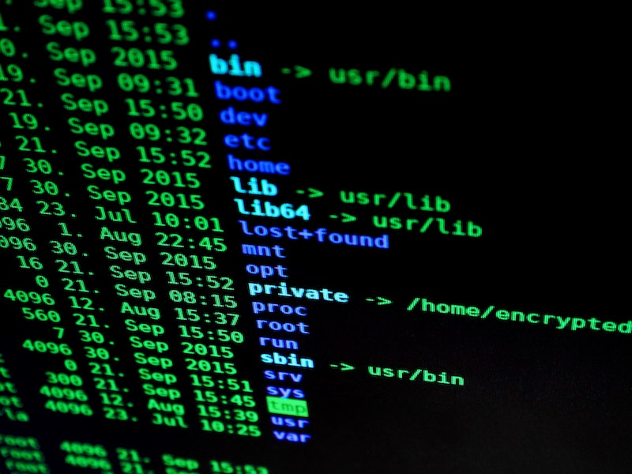

On almost every job interview there are questions about frameworks, programming principles, maybe some coding or whiteboard architecting.
On the other side, there is the way you work. Tools and skills you use on a daily basis which define how you work.
No one really asks about those things but I find them quite important.

<!--more-->

[.center-image]

Don’t get me wrong if you are hired as a software developer, programming should be your main area of expertise.
Questions that are asked on the interview are corresponding to what you’ll be doing most of the time.
Sooner or later there will be a time when getting down to the basics or pulling out some creativity will be required.
At this time those skills you have and tools you know and use on a daily basis will be very helpful and they’ll shine.
They can either save or waste great amounts of time.

[.lead]
TL;DR

* Feel comfortable using the command line - sometimes it’s the only way to do things.
* Know your shell and utilities it offers - they are stupid simple to use, they are fast, they are widely available.
* Know how to write small scripts that can automate your work.
  Automation is the king. Once you eliminate boring stuff you can focus on solving interesting problems.
* Spreadsheets - learn how to use them as they can help you with data analysis.
* Be comfortable with hacking ugly things and then removing them once the job is done.
  Be pragmatic with the tasks you have to do. Writing script in 2 hours to do 6 hours job feels great even if you remove it afterward.
* Get out of your comfort zone - become DevOps, or QA, or whatever for a day or two.
  See how things are looking on the other side of the fence. Take a look on software development from different perspectives.

[.lead]
Command-line

If you are a GUI guy and you feel repulsed when you see command line prompt you should realize that sooner or later you’ll have to work with it.
There is a certain toolset that is not available with the GUI, or GUI for those tools is simply not enough.
Are you using Git, Docker, Gradle or Maven? Those are command-line tools and get over it.
I doubt that your production server is running any graphical user interface.
At some point in time, you’ll have to SSH on it and check things.
Even if your application is in the cloud you’ll get most of it with the command line (aws-cli, kubectl).
Sometimes it’s just faster to access pod running in the Kubernetes cluster (or EC2 machine, or whatever) to check or try something quickly.

From time to time bad things happen on production and it’s better to be comfortable with the command line to avoid additional stress factors.
When business is breathing on your neck because something is not working it might be a bit too late to learn how to ssh...

[.center-image]

[.lead]
Shell utilities

Once you decide to get comfortable with the console you’ll start picking up different ways to do things.
You’ll learn how to do text processing, how to find something quickly, how to edit files.
I rarely use a file manager (this might be too extreme for others and I understand this).
I have no idea how to find something in 5 files 100mb each using file explorer, but I know how easy and fast it is using grep.
What’s more, once I’ve learned it I know how to do it almost any operating system, even on windows.
The great thing about shell utilities is that they offer low-level access to things that might not be available from the GUI.
It opens the whole area of possibilities, like automation of boring things...

Using the command line and available utilities you’ll be able to do process management in your operating system.
Take a look at the internet traffic going in and out from some ports on your machine.
Process gigabytes of text fast.
You don’t need to be walking man page on every tool, just know what’s available, everything else you’ll google.
You must know enough not delete everything from your computer by executing the command you've copied from the Internet and don’t understand ;)

If you’ve always been a GUI guy, give yourself the challenge to try and do things differently.
Try to edit files using vim and lookup things using grep.
It’s almost 2020 and I’m still using many tools I’ve been using since the 2000s
(I had a very slow computer when I was a teenager so Linux was a way to go)
things I’ve learned then are still available and useful as ever.
I’m not encouraging you to ditch your IDE in favor of emacs.
All I’m saying is that each tool should have its place and usage in our workshop.
Sometimes it’s just faster to open the console and run a couple of not efficient pipes to do the job, than looking for ready to use tool for hours...

[.lead]
Scripting

I think this is a natural evolution path.
If you get used to the console, and tools it offers you’ll start to see how many boring things can be automated from the console...
Note the https://en.wikipedia.org/wiki/Unix_philosophy#Origin[UNIX philosophy] I think it’s still relevant and many great tools developed today are adopting it.

You are not going to write a complex program, with perfect deployment pipeline and 100% test coverage, which will do alerting for one week until a bug fix is ready.
You’ll get bored doing it manually after 3rd day and on the fourth day you’ll drop production database by mistake ;)
Scripting, and scripting languages are a great way to automate things and eliminate human errors - computers are great at doing boring tasks.
Your team will also appreciate the time saved by the scripts if you’ll share with them.
You can start with bash as it’s available on almost any Linux.
With this, you’ll be comfortable creating your custom Docker images, deployment pipelines, and many awesome things.

[.lead]
Spreadsheets

[.center-image]

Basically data analysis for business people.
I have a couple of things to learn in this area and I’m aware of it.
When I have to do some data processing sometimes I know it would be easy to do if only I know more about spreadsheets.
Spreadsheets are pretty powerful tools, what’s more, business loves them.
If you need to do some data analysis and then share results with someone not technical they’ll be very happy when you’ll provide a spreadsheet with which they can work.
Again you don’t need to know everything but some basics will get you a long way.
I've never seen any serious system that doesn't export or import anything from excel so knowing basics of it will be helpful.

[.lead]
Hacking things quickly

It’s important to know when to do things right and when to do them quickly.
If you are doing some proof of concept or just creating a workaround no one will wait for 3 sprints until you write a program that does exactly that with perfect deployment pipeline (just be pragmatic).
In my opinion, It’s important to know how to put the skills you have and the tools you know into work and produce results fast.
From time to time there will be a need to do something only once and it’ll require some manual effort to be done.
If you’ll be able to write an ugly and lumpy script that gets the job done in one hour instead of eight then this is a major win.
After the job is done you should either remove the solution, rewrite it or at least document it.
You should be comfortable removing things you’ve written if they are not meant to last for a longer time.

[.lead]
Getting out of the comfort zone

[.center-image]

So you are a software developer and you are great at what you do.
Awesome now try doing something more.
Maybe try to do some QA or write an automated test, or do some DevOps stuff.
Those are things that might get you out of your comfort zone.
You’ll have the possibility to learn something new, pick up some skills and work within different constraints than usual.
It’s a great opportunity to appreciate what other team members are doing and expand your knowledge.
You’ll be not as effective as DevOps in writing Jenkins scripts but you’ll learn how it works.
Next time maybe you’ll be able to improve deployment pipeline on your own.
If at the end of the sprint there is a big queue of tasks waiting for testing why don’t you help out with delivering the sprint instead of picking up yet another ticket from the backlog which will only make testing column longer?
For me it’s refreshing and I enjoy those episodes because I believe they allow me to look at things I do more holistically.

In my opinion software development should be something more than writing yet another if statement in your favorite IDE.
Sure you get paid to do those and that should be the core of your skills, but that’s not all.
Being flexible with the tools you use and having many of them in your workshop is a great way to expand your skillset and eventually become a better software engineer.

[.small]
Images:

[.small]
* https://unsplash.com/photos/xEy9QNUCdRI
* https://www.pexels.com/photo/blur-bright-business-codes-207580/
* https://unsplash.com/photos/hpjSkU2UYSU
* https://unsplash.com/photos/XWsWp55IQr0