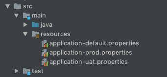

Some time ago I’ve faced a very interesting support issue. Long story short it turned out that one
of our applications was not connecting to proper service and as a result, it’s been displaying
invalid data to users. After a bit of investigation, I’ve noticed that spring’s configuration
mechanism did fallback to default value because of missing configuration key for the production
profile. In this post, I’m going to present to you how we are going to avoid similar issues in the
future.

<!--more-->

[.lead]
tl;dr

Avoid default configuration, each environment should have a dedicated profile. Write tests to
guarantee that configuration keys are setup on all environments.

[.lead]
Avoid default values

I’ve learned in a hard way that tracking properties in a more complex system (when you are on a
verge of using some dedicated tool to manage configuration for you) can be tricky and result in
unexpected problems. With spring it’s very easy to setup default values and fallback to them every
time some configuration key is missing. It might sound like a good idea at the beginning of the
project but with time number of properties will grow and it will be harder and harder to understand
what properties are used in the application. Finding which value will be used can also get
complicated. Is the value picked up from `application.properties`, or `application-prod.properties`,
or maybe it’s provided as a default to `@Value` annotation? That might not sound like a big problem
but trust me when it comes to database instance you will be using you want to be sure that you are
connecting to the right one :)

The solution to this issue is pretty simple. Just don’t use default values for properties. Each
environment has a dedicated profile and that’s all. There is no such thing as a default value. If
needed just copy the value from profile to profile. I do not consider this really as code
duplication as this is configuration dedicated for the environment and each should be fully
configured (environment, in this case, is DEV, UAT or production).

With spring it’s fairly easy, using the profile that gets activated when no profile is configured.
Its name is `default` and you can use it for your local development so you don’t have to configure
any extra parameters for your application. Consider the following properties setup:

[.center-image]

Each of those properties has only one entry with `key = profile_name environment` for example in
application-prod.properties:


key = prod environment


Now if we run the application directly from the IDE by clicking on the main class or from command
line `default` profile will be activated and values from `application-default.properties` will be
loaded. If you provide profile name like for example:


SPRING_PROFILES_ACTIVE=uat ./gradlew bootRun


UAT profile will be activated. This way you avoid having default configuration.

The only inconvenience you might face will be a configuration of logging, but I prefer to use native
logging configurations as it offers more flexibility so I’ve not faced this issue yet.
.
[.lead]
Missing configuration keys

It happens from time to time. You are developing a new feature and have to configure something. So
you just configure the key and value for your local environment as it’s required for development but
you forget to add value for other environments (or maybe you just set service URL in default
properties if you are not yet convinced that you should stop using them ;)). You deploy the
application on first environment and application will not start up because the configuration is
missing and you have to update configuration and redeploy. If you are in the rush you might forget
about value for other environments and the problem will occur again. It gets even worse with default
values (see the introduction, we’ve been using invalid service URL on production, luckily it was
read-only).

What can you do to avoid those issues in the future? Automate obviously. As we’ve faced this issue
already and we are expecting to add more configuration values we wanted to guarantee that similar
problem will not happen again. So what we did to ensure that? We created an automated check that
will fail the build when the configuration key is present in one profile and missing in other.
Simplest test case to guarantee that properties are unique can look like this:


def "properties keys are aligned across all environments"() {
    given:
    final allConfigurations = loadAllConfigurations(new File("src/main/resources"))

    when:
    final keysAlignmentChecker = checkConfigurationKeys(allConfigurations)

    then:
    assert keysAlignmentChecker.propertiesKeysAreAligned  \
        : "Not aligned configuration keys:\n" + keysAlignmentChecker.alignmentSummary
}


To load configurations we can simply list properties files in the folder and get the keys defined in
them:


private static class ConfigurationLoader {
    static List<ProfileConfiguration> loadAllConfigurations(File location) {
        final files = location.listFiles({ dir, name -> name.endsWith(".properties") } as FilenameFilter)
        if (files == null || files.length == 0) {
            throw new IllegalStateException("No configuration found in directory " + location.getAbsolutePath())
        }

        return files
                .collect {
                    new ProfileConfiguration(
                            fileName: it.name,
                            configurationKeys: loadPropertiesKeys(it))
                }
    }

    private static List<String> loadPropertiesKeys(File file) {
        Collections
                .list(PropertiesLoaderUtils
                        .loadProperties(new FileSystemResource(file))
                        .keys())
                .collect { Objects.toString(it) }
    }

    static class ProfileConfiguration {
        private String fileName
        private List<String> configurationKeys

        boolean hasKey(String key) {
            configurationKeys.contains(key)
        }
    }
}


In order to guarantee property keys are aligned across all environments we just have to ensure that
each property key defined in any file is also present in others:


private static class ConfigurationKeysAlignmentChecker {
    private List<ConfigurationsKeyAlignmentSummary> alignmentSummary

    static ConfigurationKeysAlignmentChecker checkConfigurationKeys(List<ConfigurationLoader.ProfileConfiguration> configurations) {
        def allKeys = configurations
                .collect { it.configurationKeys }
                .flatten()
                .toSet()

        return new ConfigurationKeysAlignmentChecker(alignmentSummary: allKeys.collect { key ->
            new ConfigurationsKeyAlignmentSummary(
                    configurationKey: key,
                    presentIn: findAllKeys(configurations, { profileConfig -> profileConfig.hasKey(key) }),
                    missingIn: findAllKeys(configurations, { profileConfig -> !profileConfig.hasKey(key) }))
        })
    }

    private static List<String> findAllKeys(List<ConfigurationLoader.ProfileConfiguration> configurations, Closure<Boolean> keyMatcher) {
        configurations.findAll(keyMatcher).collect { it.fileName }
    }

    String getAlignmentSummary() {
        findAllInvalidConfigurations()
                .collect { "    " + it.summary }
                .join("\n")
    }

    boolean getPropertiesKeysAreAligned() {
        findAllInvalidConfigurations().isEmpty()
    }

    private List<ConfigurationsKeyAlignmentSummary> findAllInvalidConfigurations() {
        alignmentSummary.findAll { !it.missingIn.isEmpty() }
    }

    private static class ConfigurationsKeyAlignmentSummary {
        private String configurationKey
        private List<String> missingIn
        private List<String> presentIn

        private String getSummary() {
            "Configuration key: '${configurationKey}' missing in ${missingIn} present in ${presentIn}"
        }
    }
}


[.small]
https://github.com/blog-pchudzik-examples/blog-eample-spring-properties-misconfiiguration[Complete source code.]

With that you can deploy with confidence as your tests will ensure that each environment is fully
configured.

Again logging configuration can be problematic and can cause you some issues. You can avoid the
issue by filter out all keys starting with `logging` prefix (if you assume logs are not so crucial
for you). Another problem you might face are properties that populate lists by its index values in
spring boot (like: `list[0]=a`, `list[1]=b`, ...) as a number of items in the list is expected to be
different between environments. But as with logging, you can tweak the code to somehow ignore those
properties or simplify this key to just property name without the index. The point is, those tests
are plain groovy code so you can do whatever is required and customize it in any way you want :)

[.lead]
Summary

Being so strict about application configuration might look like an overkill but trust me nothing
gets you more on the edge when you are not sure on which database backward incompatible migration
has just started running... With simple approach change - no default configuration by default and in
less than 100 lines of code you can increase your confidence in application configuration and be
certain that you’ll not get surprised by missing or misplaced configuration on production.

