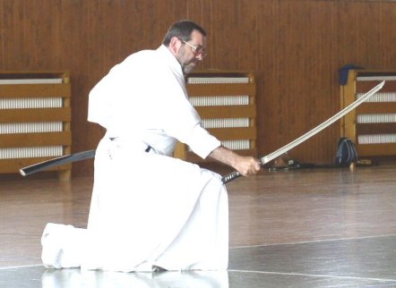
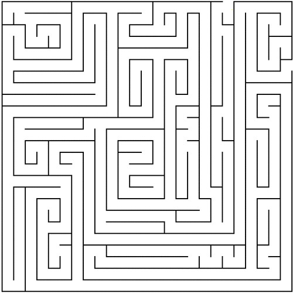
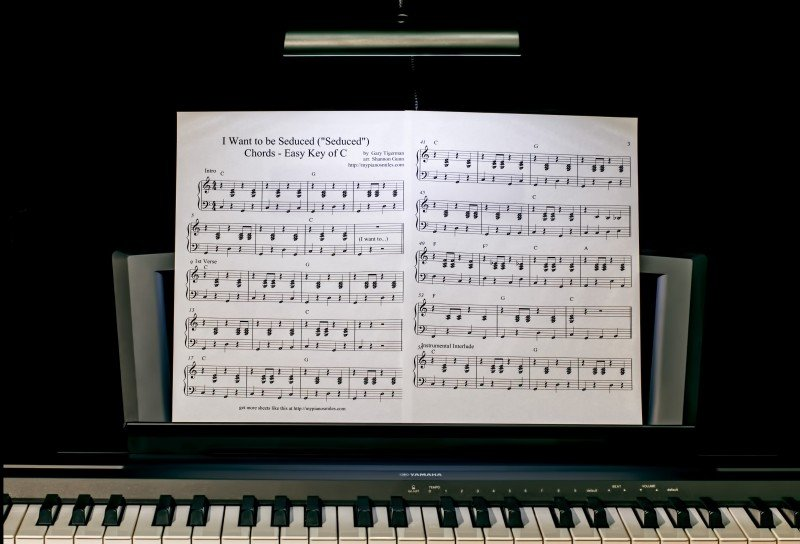

I’m learning python for some time now. I've made myself familiar with the syntax and then started
looking into other ways to increase my knowledge about language and learn its quirks. I’ve found a
very nice site that allows me to practice basics and strengthen different kind of muscles that I’m
using in my day job - https://adventofcode.com[adventofcode].

<!--more-->

[.center-image]

The idea behind https://adventofcode.com[adventofcode] is very simple -  during advent time before
Christmas everyday you get a task to solve. I'm not into the theme too much as it’s August now :)
What I care about are problems that can be solved. At work, I'm facing different kind of challenges
and those in adventofcode are more like sudoku and allow to learn the language more deeply and learn
about its features.

One of the problems to solve recently was based on solving the maze (more than one actually but they
usually differ in some ways). I’m not going to show my https://github.com/pchudzik/adventofcode[ugly
python code] (you are opening it on your responsibility). As you’ll find many sites on the internet
that will show you how to implement BFS or maybe event how to solve the maze. I just wanted to point
out something different so bear with me for a moment.

It might sound lame but I’ve never had a chance to write maze solving program. I’ve struggled with
it a bit as those are not problems I’m accustomed to and once I got it working I was really
satisfied.

[.center-image]

If you look at the maze problem that’s a graph in which you have to find the shortest (or existing)
path to exit (some&nbsp;node). So I had a chance to refresh my knowledge on this topic (because who
remembers what one has learned years&nbsp;ago…) and I’ve (re)discovered a couple of graph traversing
algorithms and then implemented one, then struggled a bit on how measure traveled distance and
finally got this thing working.

The point

By doing those puzzles I’m getting:

* Knowledge refresher (some problems are really interesting and it takes some time until you figure
  out what to ask google for :))
* Algorithm implementation practice with some tweaking (no copy-paste rule - you must understand
  what’s going on)
* Good brainteaser (if you are into that)
* Language programming practice (I think it’s a good way of getting familiar with the syntax and
  possibilities of the language you've started practicing)
* Satisfaction of solving problems that do not exist (that’s the winner I think) ;)

Maybe you’ve heard about programming katas. In the beginning, I didn’t get the idea but now I
understand it when I’ve found my way of implementing it. If you’ll find the right problems to solve
and some time to do them you’ll find it "entertaining and rewarding" (some people like to solve
sudoku or crosswords). And you can get more of it as you’ll start working the muscle and practicing
something different that you do in your day to day job. For me it clicked when I’ve found
interesting problems to solve and my way of practicing it  - one puzzle a week and I should be
satisfied with the solution (rewrite is ok).

[.center-image]

I think that solving those challenges made me a bit better at what I do (at least I’m feeling ok-ish
with python and know and understand BFS algorithm and a couple of others which I already forgot ;)).
I’ve also found a pretty solid way of strengthening my problem-solving muscle and practicing new
programming language at the same time while I’m getting some "fun" when doing those things. I
recommend you try it and see for yourself, who knows maybe you’ll find some possibilities of growth
in this as well.

If you want to give it a try you can check out:

* https://adventofcode.com[Adventofcode website] (running since 2015, for me, there is enough for 2
  years of puzzles in there)
* https://www.reddit.com/r/dailyprogrammer[Daily programmer]

[.small]
Images https://en.wikipedia.org/wiki/Kata#/media/File:Iaido2.jpg,
https://visualhunt.com/f2/photo/11284799355/d3380765d0/, https://visualhunt.com/photo/172434/