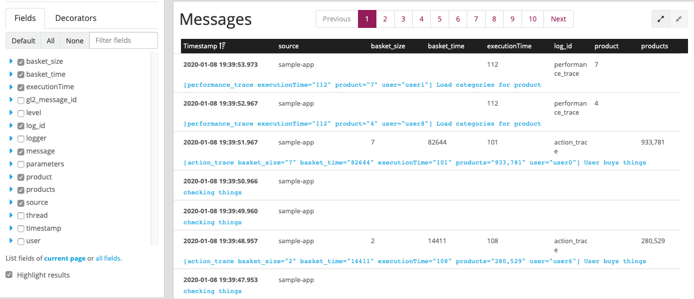

When I’ve first learned that there is something more than printing things to console log4j was state of the art solution.
Then SLF4J joined the party and improved where log4j was lacking.
The new version of LOG4J is available for some time already and I didn’t have a chance to look at what if offers.
Let’s examine what’s possible with the second version of a very well known logging library.

<!--more-->

This is meant to be a TL;DR overview of LOG4J2 documentation to quickly comprehend what’s available on a very high level.
If you are interested in more details go ahead and check out the documentation by yourself.

[.lead]
org.apache.logging.log4j.message.Message

https://logging.apache.org/log4j/2.x/manual/messages.html[Message objects]
for me - as an end-user the biggest difference is that now I can log objects instead of plain strings.
Logging simple strings is still possible but https://logging.apache.org/log4j/2.0/log4j-api/apidocs/index.html?org/apache/logging/log4j/message/Message.html[Message] interface offers more possibilities to customize logs and standardize them to fit your needs.


new StructuredDataMessage(
    "action_trace",
    "User buys things",
    "user",
    Map.of(
        "executionTime", randomValue(100, 20),
        "products", "" + randomValue(1000) + "," + randomValue(1000),
        "user", "user" + randomValue(10),
        "basket_time", randomValue(10_000, 100_000),
        "basket_size", randomValue(10))) 
With custom messages, it is easy to create a message with a format that will fit our needs exactly and that can be globally used by all team members.
One example of it might be StructuredMessage that allows to relatively easily parse messages in Graylog and by default is formatted to match https://tools.ietf.org/html/rfc5424[syslog message standard]:

[.center-image]

[.lead]
Event Logging

https://logging.apache.org/log4j/2.x/manual/eventlogging.html[Event logging] - audit system based on logs.
It might not be a bad idea if you’ll put those logs in some kind of DB (DB appenders are available).
log4j2 promises not to lose any messages so if it fits your auditing needs it might be a pretty convenient tool to use.


public String doFundsTransfer(Account toAccount, Account fromAccount, long amount) {
      toAccount.deposit(amount);
      fromAccount.withdraw(amount);
      String confirm = UUID.randomUUID().toString();
      StructuredDataMessage msg = new StructuredDataMessage(confirm, null, "transfer");
      msg.put("toAccount", toAccount);
      msg.put("fromAccount", fromAccount);
      msg.put("amount", amount);
      EventLogger.logEvent(msg);
      return confirm;
}

[.lead]
Mapped Diagnostic Context

Extensions/improvement of MDC - https://logging.apache.org/log4j/2.x/manual/thread-context.html[ThreadContext] allows to include some information which will be logged with every message produced from the current thread.
Very useful when using correlation ids - just put it into context before starting any real work and you are good to go (just don't forget to include it in your https://logging.apache.org/log4j/2.x/manual/layouts.html#Patterns[layout configuration] - %X).


try (CloseableThreadContext.Instance ctx = CloseableThreadContext
        .put("id", UUID.randomUUID().toString())
        .put("ipAddress", "192.168.1.1")
        .put("loginId", "user123")
        .put("hostName", "dark-start-33")) {
    log.info("Message 1");
    log.info("Message 2");
}

You can implement simple https://javaee.github.io/javaee-spec/javadocs/javax/servlet/Filter.html[Filter] that will put some diagnostic information into context before processing request (correlation id, user id, anything you might need).
This can produce something like (depending on layout configuration):


10:28:06.973 [main] INFO  c.p.b.e.s.App - Message 1 - {hostName=dark-start-33, id=d655ac4e-19e2-408a-a214-e827de32b639, ipAddress=192.168.1.1, loginId=user123}
10:28:06.974 [main] INFO  c.p.b.e.s.App - Message 2 - {hostName=dark-start-33, id=d655ac4e-19e2-408a-a214-e827de32b639, ipAddress=192.168.1.1, loginId=user123}


From logs like this you'll be able to easily track what user has been doing, correlate all his logs easily and track request flow through your application.

[.lead]
Log builder

https://logging.apache.org/log4j/2.x/manual/logbuilder.html[LogBuilder] as the name suggests it allows us to build log messages in a more fluent way.


logger
    .atInfo()
    .withMarker(marker)
    .withLocation()
    .withThrowable(exception)
    .log("Login for user {} failed", userId);

[.lead]
Flow tracing

https://logging.apache.org/log4j/2.x/manual/flowtracing.html[Flow Tracing].
In latests log4j version there are dedicated methods that can be used to log message at the beginning and end of each method and then easily filter those messages or append them to custom location and check how logic flows in the application.
This might come in handy but will bloat your code with additional log invocations if used directly (https://logging.apache.org/log4j/2.x/manual/markers.html[Markers] can help you to improve it).


public void setMessages(String[] messages) {
    logger.traceEntry(new JsonMessage(messages));
    this.messages = messages;
    logger.traceExit();
}


[.lead]
Markers

https://logging.apache.org/log4j/2.x/manual/markers.html[Markers] can be used to easily filter produced log messages, to search them easily or to redirect log messages to different appenders.
For example logs from flow tracing can be easily redirected to separate files so they are not flooding your more significant logs and based on this marker you can have different policies of storing them.


private static final Marker SQL_MARKER = MarkerManager.getMarker("SQL");
private static final Marker QUERY_MARKER = MarkerManager.getMarker("SQL_QUERY").setParents(SQL_MARKER);

public String doQuery(String table) {
    logger.debug(QUERY_MARKER, "SELECT * FROM {}", table);
    String result = ...
    return logger.traceExit(result);
}


[.lead]
Configuration and extensions

A number of changes for day to day work look promising and what’s more, there is a lot of additional things delivered along with LOG4J2 including:

* New https://logging.apache.org/log4j/2.x/manual/configuration.html[configuration options] to name a few:
  the syntax of configuration (XML, JSON, YAML), variables and properties substitution or scripting inside configuration.
  In the past when I needed it I was forced to prepare separate configurations for logging system or write clumsy groovy scripts for logback configuration.
* A ton of appenders like async, Cassandra, JDBC, JPA, JMS, HTTP, Kafka, MongoDB, Syslog, zeroMQ, and a https://logging.apache.org/log4j/2.x/manual/appenders.html[lot more].
* https://logging.apache.org/log4j/2.x/manual/filters.html[Filters] to process messages based on some rules.
  With markers and filters, you can build pretty complicated log messages flow.
* Dedicated https://logging.apache.org/log4j/2.x/manual/extending.html[extension points] and https://logging.apache.org/log4j/2.x/manual/plugins.html[plugin API].

[.lead]
Summary

Years ago when I’ve been starting a new project it was obvious to use log4j as logging library.
Next, it was slf4j turn to rule in the log realm.
Now I think more people will witch to log4j2 as it offers a lot of features.
Next time I’ll be starting a new project I’ll probably choose log4j over slf4j as it seems to offer more possibilities now.
The only thing that might be interesting to find out is how those changes in log4j2 will impact application performance in the long run (especially GC usage on older JVM machines).

[.small]
To be fair a lot of this is already available in slf4j.
But it seems like slf4j lost some of its momentum now and new features and improvements are developed much slower than they used to.

[.small]
Samples are from log4j documentation website but they've been abbreviated.
