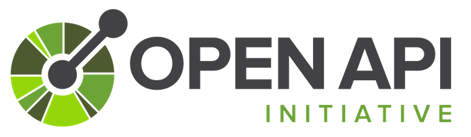
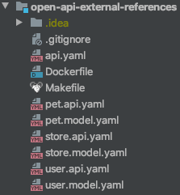

Real-life OpenAPI specification files tend to go really big really fast.
In this post, I’ll try to explore how we can split single specification file into multiple files and don’t get crazy while scrolling up and down like a mad man.

<!--more-->

[.center-image]


[.small]
<<video-preview, Screen recording for the impatient.>>

I think that most popular tool to edit specification files is https://editor.swagger.io[swagger editor].
It's very easy to use but unfortunately there is no way to load things from external files (eg. `$ref` to country enum defined in external file).
It'll not load references to external files even if you set it up locally or in docker :(

Problem is that life is a bit more complicated than a pet store sample.
I’ve already seen thousands of lines in a single specification file and we are just starting to define APIs for our application.
Working with such a big file is troublesome and I can barely find my way around anything longer than 4-5 screens.

I’ve started looking for a solution to this issue and at first, I found https://stoplight.io[stoplight] (https://youtu.be/7olnV8rR1xc?t=791[webinar presenting how to us it] but I think it's better just to download and play around with stoplight studio) which offers nice code and UI editor.
It’s ok to use and supports referencing external files without any issues.
You should give it a try maybe it'll suit you.
When I’ve been using it I’ve been missing "something" and couldn't get used to it.
I’ve started to look at what it’ll take to edit the specification files in the IDE of my choice and have live preview of the API (I’m not considering paid plugins at this point).

I like swagger-ui and you probably have it already embedded in your application somewhere.
After a bit of searching and reading GitHub issues on supporting external references in swagger-editor I’ve stumbled upon https://github.com/moon0326/swagger-ui-watcher[swagger-ui-watcher].
It displays API in swagger-ui and thanks to a bit of hacking loads references to external files.
Once I investigated what’s possible I decided to try and play around with it in some project and see how it'll fit in my workflow.

[.lead]
Sample

Here’s how I’ve configured it in a way that works for me.
First of all, let’s create API and split it over multiple files.
For the sake of example, I’ll do it on pet store sample as everyone at some point have already seen it.

Let’s split single api.yaml it into multiple files:



I've splitted pet store sample into following files:

* pet management - `pet.api.yaml` with api definitions of pet endpoints and `pet.model.yaml` with models used in the API
* user management - `user.api.yaml` for user management and `user.model.yaml` for user models
* store - `store.api.yaml` for store api and `store.model.yaml` for Order model
* api - `api.yaml` entry point of the API

After this `api.yaml` looks like this:


openapi: 3.0.1

#info, servers, tags, etc

paths:
  /pet:
    $ref: 'pet.api.yaml#/pet'
  /pet/findByStatus:
    $ref: 'pet.api.yaml#/pet-findByStatus'
  /pet/findByTags:
    $ref: 'pet.api.yaml#/pet-findByTags'
  /pet/{petId}:
    $ref: 'pet.api.yaml#/pet-petId'
  /pet/{petId}/uploadImage:
    $ref: 'pet.api.yaml#/pet-petId-uploadImage'

  /store/inventory:
    $ref: 'store.api.yaml#/store-inventory'
  /store/order:
    $ref: 'store.api.yaml#/store-order'
  /store/order/{orderId}:
    $ref: 'store.api.yaml#/store-order-orderId'

  /user:
    $ref: 'user.api.yaml#/user'
  /user/createWithArray:
    $ref: 'user.api.yaml#/user-createWithArray'
  /user/createWithList:
    $ref: 'user.api.yaml#/user-createWithList'
  /user/login:
    $ref: 'user.api.yaml#/user-login'
  /user/logout:
    $ref: 'user.api.yaml#/user-logout'
  /user/{username}:
    $ref: 'user.api.yaml#/user-username'

components:
  schemas:
    Order:
      $ref: 'store.model.yaml#/Order'

    User:
      $ref: 'user.model.yaml#/User'

    Tag:
      $ref: 'pet.model.yaml#/Tag'
    Category:
      $ref: 'pet.model.yaml#/Category'
    Pet:
      $ref: 'pet.model.yaml#/Pet'
    ApiResponse:
      $ref: 'pet.model.yaml#/ApiResponse'

  # securitySchemes:


[.small]
https://github.com/blog-pchudzik-examples/open-api-workflow/blob/master/api.yaml[full api.yaml]

For me it's more readable as I can see what endpoints are available at the first glance and what models are supported.
If I'll be interested in any particular domain supported by the API I know exactly into which file I need to dig in and can open api and model next to each other to effectively work with them.
I can also work on the model and api at the same time and open model and api files next to each other and work on them at the same time.

[.small]
Note that this setup will generate warning about model duplication from openapi-generator, but it can be ignored it is just a warning ;)

That was an easy part and now we have something which I think is easier to understand and maintain than one file with 12k lines of YAML code...
Now we need tools to support it.
Let’s start with editing it with live preview in swagger-ui:

I've put it into docker so we don't have to install whole nodejs setup to work on java or python project.


FROM node:12-alpine3.10

RUN npm install -g swagger-ui-watcher

RUN echo $'#!/bin/sh\n\
swagger-ui-watcher -h 0.0.0.0 --no-open $@ \n\
\n ' > /watch.sh

RUN echo $'#!/bin/sh\n\
swagger-ui-watcher $1 --bundle $2 \n\
\n ' > /bundle.sh

RUN chmod +x /watch.sh
RUN chmod +x /bundle.sh

EXPOSE 8080
VOLUME /api

WORKDIR /api
CMD ["/watch-api.sh"]


And now using Makefile you can run it with single short command (or you can type docker incantations every single time):


api-preview-image:
	docker build . -t api-preview

watch:
	docker run --rm -it \
		-p 8000:8000 \
		-v ${PWD}:/api \
		api-preview /watch.sh /api/api.yaml


[[video-preview]]
Just execute ```make watch``` and open http://localhost:8000 in your favourite browser.
Place IDE next to a browser window and enjoy:

[.center-image]
video::workflow.mov[width=640]

To generate simple spring-boot based server you don't have to do anything :)
You can generate server using openapi-generator-cli (you can also put this in the Makefile or in pom.xml):
You don't have to do anything. openapi-generator supports loading references pointing to file localized on disk.


docker run --rm \
    -v ${PWD}:/local openapitools/openapi-generator-cli generate \
    -i /local/api.yaml \
    -g spring \
    -o /local/spring-server \
    -p apiPackage=com.pchudzik.blog.example.apieditor.api \
    -p basePackage=com.pchudzik.blog.example.apieditor \
    -p modelPackage=com.pchudzik.blog.example.apieditor.model \
    -p artifactId=apieditor \
    -p java8=true


That was easy.
BUT https://github.com/zalando/connexion[connexion] which I use to work with openAPI in python doesn't support referencing files located on disk - https://github.com/zalando/connexion/issues/967.
I quickly found a solution to this problem - just bundle everything into one HUGE json files and use it with connexion:


bundle:
	docker run --rm -it \
		-v ${PWD}:/api \
		api-preview /bundle.sh api.yaml api.all.json


Now just feed api.all.json to connexion:


import connexion

api_app = connexion.App(__name__, specification_dir='../api')
api_app.add_api('api.all.json')
api_app.run(port=8181, debug=True)


[.small]
I’ll leave more of python details for now.

Here’s how my current workflow looks like:

* Edit multiple open api specification files using my favourite IDE and with live preview in a browser opened next to it.
* Bundle everything into huge JSON specification including all external references.
* Generate python client so that I don’t have to write and maintain multiple model classes by myself and easily dump json from them
* Feed generated JSON file to connexion and write handler methods
* Repeat until satisfied

So far it’s working for me.
With java and https://github.com/OpenAPITools/openapi-generator/tree/master/modules/openapi-generator-maven-plugin[openapi-generator-maven-plugin] it will be a bit easier as you don't have to bundled everything into single file.
I’m happy I invested some time in finding tools that support the way I prefer to work instead of forcing me into workflow which I don't like.

[.small]
https://github.com/blog-pchudzik-examples/open-api-workflow[Full project with Makefile, yamls, and Dockerfile]
