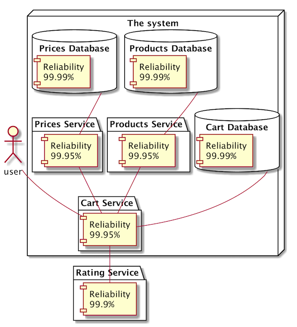

At work, we are splitting the monolithic application into smaller services.
From time to time we have some challenges in doing it the right way.
Lately, most of the splitting is focused on cutting out frontends to be outside of the monolith.
It gives solid results as we are getting logic and business rules in one place.
The downside is that most of the communication has to be synchronous which creates interesting problems to solve.

<!--more-->

[.lead]
Reliability

Before starting we should try and identify what reliability of the service means in terms of numbers:

|===
|Success Rate|Failed requests out of 100k|Unavailable daily|Unavailable weekly|Unavailable monthly|Unavailable yearly

|90,000%
|10 000
|144 minutes
|more than 16h
|more than 74h
|more than 36 days

|95,000%
|5 000
|72 minutes
|more than 8h
|more than 37h
|more than 18 days

|99,000%
|1 000
|14 minutes
|100 minutes
|more than 7h
|more than 3 days

|99,900%
|100
|1,44 minute
|10,08 minutes
|44,64 minutes
|more than 8h

|99,950%
|50
|0,72 minutes
|5,04 minutes
|22,32 minutes
|262,80 minutes

|99,990%
|10
|0,14 minutes
|1,01 minutes
|4,46 minutes
|52,56 minutes

|99,999%
|1
|0,01 minutes
|0,10 minutes
|0,45 minutes
|5,26 minutes
|===

Depending on how you decide to look at those numbers.
It can either mean that even "four nines" mean service being unavailable for almost for an hour during the year and still be within SLA.
Or that certain percentage of requests can fail without breaking any SLA's (in this case 10 requests on every 100_000 can fail).

Now, this is all really nice if you have only one service you really on.
But what if you have more because not a single system is working in the void.
There is usually a database required and maybe some other services collaborate on producing results.

Suppose you have a service that is responsible for handling some user requests.
This service pulls some data from the database.
Calls one external service to fetch some ratings.
Then it calls two internal services to load all additional data.
Assuming again that every system has success rate of at least 99,95%.
Something like below is required to provide a response to the user:

[.center-image]

You’ve probably seen more complicated systems.
If we now assume that everything is called synchronously we can easily calculate the success rate of the call to the Cart Service as:


Reliability of Cart Service (99.95%)
* Reliability of Cart Database (99.99%)
* Reliability of Rating Service (99.95%)
* Reliability of Products Service (99.95%)
* Reliability of Products Database (99.99%)
* Reliability of Prices Service (99.95%)
* Reliability of Prices Database (99.99%)


All of this gives you reliability of around 99,81%.
If you put it to the table with the time service can be unavailable:

|===
|Success Rate|Failed requests out of 100k|Unavailable daily|Unavailable weekly|Unavailable monthly|Unavailable yearly

|99,81%
|18,99
|almost 3 minutes
|19 minutes
|almost 85 minutes
|more than 16 hours
|===

It means that Cart Service can be unavailable for almost 20 minutes weekly.
Or looking at the success rate it means that on every 100_000 requests almost 20 will fail.
Now think what happens when your systems availability is lower than those 99,95% and/or you have more services...

[.lead]
Sources of failure

Internal error of the service might happen

Something bad happens in the service itself.
Cart Service might throw some random NullPointerException just like that.
It happens from time to time ;)
You’ve missed this one parameter that used to be nullable last year but now is required.
Simple programming mistakes can cause serious problems and there is no silver bullet to eliminate them all.
Now think about SLA and a mistake that affects only 5% of the users...

Network communication might fail

Prices service times out because of high CPU usage.
Or maybe Kubernetes just decided to move the pod to the other node.
Communication failure is one of the most common failures that can hit you, and they are especially painful if your communication is synchronous.
Luckily we have tools and techniques that can help us get through difficult times.

Hardware might fail

Out of disk space on Products Service host.
Maybe your hosting provider has some data center issues.
However your application is deployed sooner or later there is a machine responsible for running your code and those fail from time to time.

Cascading failures

When many services depend on one particular function and this critical functionality fails many other services can stop working.
A good example might be user service responsible for authorization of requests.
If almost every request needs to be authorized and the service responsible for it stops working you can not do anything in your system.
Failure in User authorization service propagates through the system and affects potentially unrelated features.

[.lead]
Failure is not a matter of IF but WHEN.

Once we have some theory on the table we can start working on what we can do about those errors.
In the next post, I’m going to focus on what you as a programmer can do to mitigate some of the risks.
Investigate what libraries and techniques you can use to minimize some of the risks mentioned here.
Being resistant to errors might be especially important when service you are using has scheduled maintenance of one hour...
